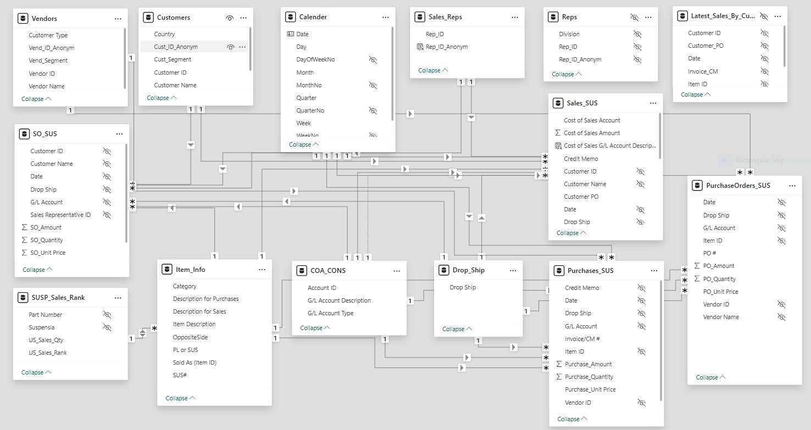

# Unified Power BI Semantic Model: Advanced Business Analytics with DAX & M

## Table of Contentss

- [The Need for a Comprehensive Data Model](#the-need-for-comprehensive-data-model)

- [Tools](#tools)

- [Tables](#tables)
  - [Date Table](#date-table)
  - [Item Info Table](#item-info-table)
  - [Customers Table](#customers-table)
  - [Vendors Table](#vendors-table)
  - [Sales Table](#sales-table)
  - [SO Table (Sales Orders)](#so-table-sales-orders)
  - [Purchases Table](#purchases-table)
  - [PO Table (Purchase Order)](#po-table-purchase-orders)
  - [Chart of Accounts Table](#chart-of-accounts-table)
  - [Sales Representatives Table (Reps)](#sales-representatives-table-reps)
  - [Invoices & Job IDs](#invoices--job-ids)
  - [USA Sales Ranking Table](#usa-sales-ranking-table)
- [Model Relationship Diagram](#model-relationship-diagram)
- [DAX Measures](#dax-measures)
  - [Sales Amount Last 12 Months (Rolling)](#sales-amount-last-12-months-rolling)
  - [Top N Customers by Sales](#top-n-customers-by-sales)
  - [Purchase to Sales Ratio](#purchase-to-sales-ratio)
  - [Sales per Representative](#sales-per-representative)
  - [Year-over-Year (YoY) Sales Growth](#year-over-year-yoy-sales-growth)
  - [Average Days Between Order and Invoice](#average-days-between-order-and-invoice)
  - [SKUs with No Sales (Active Items Only)](#skus-with-no-sales-active-items-only)
  - [Stock Coverage in Days](#stock-coverage-in-days)
  - [Sales Rank by Part Number](#sales-rank-by-part-number)
  - [Repeat Customers Percentage](#repeat-customers-percentage)
  - [Customer Cohort Analysis (Monthly)](#customer-cohort-analysis-monthly)
  - [Customer Churn Rate](#customer-churn-rate)
  - [Dynamic Pareto Segmentation (ABC)](#dynamic-pareto-segmentation-abc)
  - [Sales Representative Dynamic Ranking](#sales-representative-dynamic-ranking)
- [Calculated Columns](#calculated-columns)
  - [Customer Segmentation by Lifetime Value (Customers Table)](#customer-segmentation-by-lifetime-value-customers-table)
  - [SKU Sales Velocity (Item_Info Table)](#sku-sales-velocity-item_info-table)
  - [PO Delivery Delay Flag (POJ_SUS Table)](#po-delivery-delay-flag-poj_sus-table)
  - [Customer Recency Category (Customers Table)](#customer-recency-category-customers-table)
  - [Dynamic Product Margin Category (Item_Info Table)](#dynamic-product-margin-category-item_info-table)
  - [Dynamic Vendor Quality Rating (Vendors Table)](#dynamic-vendor-quality-rating-vendors-table)
- [Dashboards & Visuals](#dashboards--visuals)

---

## The Need for a Comprehensive Data Model

Company faced significant challenges due to fragmented and inconsistent data scattered across multiple sources, such as sales records, purchase orders, inventory details, customer interactions, and financial accounts. This fragmentation hindered the company’s ability to generate timely, accurate, and comprehensive insights necessary for strategic decision-making. Establishing a unified, structured, and comprehensive data analytics model became crucial to streamline data integration, ensure data integrity, and empower Suspensia with actionable insights for improved business performance and informed decision-making.

## Tools

- PowerBI
- SQL Server

## Tables

Below is a list of tables loaded and structured within Power BI. Each table serves a distinct purpose and is either linked to SQL servers, loaded as-is from flat files or transformed through Power Query (M language). Some tables are created dynamically (e.g., Date Table), while others are merged or cleaned versions of raw exports from the company’s accounting system or supporting databases.

### Date Table

The Date Table serves as the foundational time dimension for the entire data model, enabling consistent and accurate time-based analytics and comparisons. It provides a standardized way to analyze data across different time periods such as yearly, quarterly, monthly, weekly, and daily views.

#### **Source:**
Created dynamically using **Power Query (M language)** within Power BI. This method ensures the date table automatically updates to include current dates.

#### **Columns Included:**
| Column Name   | Description                                      | Example        |
|---------------|--------------------------------------------------|----------------|
| `Date`        | Individual date entries                          | 2024-01-01     |
| `Year`        | Year number                                      | 2024           |
| `Quarter`     | Quarter name                                     | Q1, Q2, Q3, Q4 |
| `QuarterNo`   | Quarter number                                   | 1, 2, 3, 4     |
| `Month`       | Month name                                       | January        |
| `MonthNo`     | Month number                                     | 1              |
| `Week`        | Week number within the year                      | 1-52           |
| `WeekNo`      | Week number aligned to fiscal or calendar weeks  | 1-52           |
| `Day`         | Day of the month                                 | 1-31           |
| `DayOfWeekNo` | Numeric representation of the weekday            | 1 (Monday)     |

Below is the M code to dynamically generate a Date Table within Power BI, which automatically updates from January 1, 2018, to the current date:


```m language
let
    //Variables
    Start_Date = #date(2018, 1, 1),
    End_Date = DateTime.Date(DateTime.LocalNow()),
    Duration_VAR = Duration.Days(Duration.From(End_Date-Start_Date))+1,
    Dates = List.Dates(Start_Date,Duration_VAR,#duration(1,0,0,0)),
    #"Converted to Table" = Table.FromList(Dates, Splitter.SplitByNothing(), null, null, ExtraValues.Error),
    #"Renamed Columns" = Table.RenameColumns(#"Converted to Table",{{"Column1", "Date"}}),
    #"Changed Type" = Table.TransformColumnTypes(#"Renamed Columns",{{"Date", type date}}),
    #"Inserted Year" = Table.AddColumn(#"Changed Type", "Year", each Date.Year([Date]), Int64.Type),
    #"Inserted QuarterNo" = Table.AddColumn(#"Inserted Year", "QuarterNo", each Date.QuarterOfYear([Date]), Int64.Type),
    #"Custom Column for Quarter" = Table.AddColumn(#"Inserted QuarterNo", "Quarter", each "Q"&Text.From([QuarterNo])),
    #"Inserted Month" = Table.AddColumn(#"Custom Column for Quarter", "Month", each Text.Start(Date.MonthName([Date]),3), type text),
    #"Inserted MonthNo" = Table.AddColumn(#"Inserted Month", "MonthNo", each Date.Month([Date]), Int64.Type),
    #"Inserted WeekNo" = Table.AddColumn(#"Inserted MonthNo", "WeekNo", each Date.WeekOfYear([Date]), Int64.Type),
    #"Custom Column for Week" = Table.AddColumn(#"Inserted WeekNo", "Week", each "Week "&Text.From([WeekNo])),
    #"Inserted Day" = Table.AddColumn(#"Custom Column for Week", "Day", each Text.Start(Date.DayOfWeekName([Date]),3), type text),
    #"Inserted DayOfWeekNo" = Table.AddColumn(#"Inserted Day", "DayOfWeekNo", each Date.DayOfWeek([Date]), Int64.Type)
in
    #"Inserted DayOfWeekNo"
```

---

### Item Info Table

#### Purpose
The **Item_Info** table serves as the central item dimension, containing key metadata used across sales, purchase, and inventory tables. It ensures product consistency and traceability, even when part numbers evolve over time due to OE changes or engineering updates — a common need in the automotive industry.

This table enables robust item-level analytics by standardizing descriptions, categories, and cross-references. It also merges external references and catalog data for enriched analysis.

#### Source and Creation Method
- **Primary Source:** `SQL Server` Catalog_Items
- **Supplementary Tables (SQL Server):**
  - `Number_Change_Track_Table`: Used during transformation to update obsolete part numbers.
  - `Buyersguide_Crossed`: Merged into the final result for catalog-based enrichment.

- **Creation Method:**
  - Loaded via Power Query.
  - Merged with `Number_Change_Track_Table` to replace superseded `First_SUS#` values with the latest `Final_SUS#`.
  - Enriched with automotive application data from `Buyersguide_Crossed`.

#### Special Handling: Superseded Part Numbers

In the automotive industry, it’s common for part numbers to be superseded over time. To manage this:

- The **`Number_Change_Track_Table`** includes:
  - `First_SUS#`: The old part number being replaced.
  - `ChangeDate`: When the change occurred.
  - `Final_SUS#`: The new replacement part number.

- This table is not loaded into the Power BI data model directly, but used in **Power Query transformations**.
- The merge ensures all outdated part numbers in `Item_Info` are updated to the most recent version, maintaining a consistent identifier (`Final_SUS#`) across time-series data and preventing fragmentation in analysis.

#### Additional Enrichment: Buyers Guide Merge

To provide rich automotive catalog context, `Item_Info` is further enriched with data from the **`Buyersguide_Crossed`** SQL table, which includes:

- Vehicle compatibility (Make, Model, Year)
- OEM and aftermarket cross-references
- Application-specific part descriptions
- Quantity required per vehicle
- Opposite-side part suggestions

This allows the model to answer real-world catalog questions such as:
- “What does this part fit?”
- “What is the OE number for this SKU?”
- “Is there an opposite side part I should stock?”

#### (M) Code to Form Item Info Table

This M code loads and transforms item metadata from a SQL Server table. It includes logic for superseded part number resolution and catalog enrichment. These transformations ensure SKU continuity and complete vehicle fitment context — which is critical for operations in the automotive aftermarket.

```powerquery-m
let
    // Step 1: Connect to SQL Server and load the item master table
    Source = Sql.Database("SERVER_NAME", "Suspensia_DB"),
    ItemMaster = Source{[Schema="dbo", Item="SUS_SAGE_ITEM_CROSS"]}[Data],

    // Step 2: Promote the first row to column headers (if needed)
    #"Promoted Headers" = Table.PromoteHeaders(ItemMaster, [PromoteAllScalars=true]),

    // Step 3: Set data types for core fields
    #"Changed Type" = Table.TransformColumnTypes(#"Promoted Headers", {
        {"Item ID", type text},
        {"Item Description", type text},
        {"Description for Sales", type text},
        {"Description for Purchases", type text},
        {"Suspensia Cross", type text},
        {"TYPE", type text}
    }),

    // Step 4: Rename columns for semantic clarity
    #"Renamed Columns" = Table.RenameColumns(#"Changed Type", {
        {"Suspensia Cross", "Before_Superseed"},
        {"TYPE", "PL or SUS"},
        {"Item ID", "Sold As (Item ID)"}
    }),

    // Step 5: Merge with Number_Change_Track table to replace outdated part numbers
    #"Merged Number_Change_Track" = Table.NestedJoin(#"Renamed Columns", {"Before_Superseed"}, Number_Change_Track, {"FirstSus#"}, "Number_Change_Track", JoinKind.LeftOuter),

    // Step 6: Expand final part number from tracking table
    #"Expanded NumberChangeTrack_Q" = Table.ExpandTableColumn(#"Merged Number_Change_Track", "Number_Change_Track", {"FinalSus#"}, {"FinalSus#"}) ,

    // Step 7: Use final number if available, else fallback to original
    #"Added Conditional Column" = Table.AddColumn(#"Expanded NumberChangeTrack_Q", "SUS#", each if [#"FinalSus#"] = null then [Before_Superseed] else [#"FinalSus#"]),

    // Step 8: Remove temp fields
    #"Removed Columns" = Table.RemoveColumns(#"Added Conditional Column",{"Before_Superseed", "FinalSus#"}),

    // Step 9: Ensure consistent data type
    #"Changed Type1" = Table.TransformColumnTypes(#"Removed Columns",{{"SUS#", type text}}),

    // Step 10: Merge BuyersGuide catalog data from SQL
    #"Merged Queries" = Table.NestedJoin(#"Changed Type1", {"SUS#"}, BuyersGuide_Crossed, {"Sus"}, "BuyersGuide_Crossed", JoinKind.LeftOuter),

    // Step 11: Expand catalog fields
    #"Expanded BuyersGuide_Crossed_Q" = Table.ExpandTableColumn(#"Merged Queries", "BuyersGuide_Crossed", {"Category", "OppositeSide"}, {"Category", "OppositeSide"}),

    // Step 12: Remove duplicate item entries
    #"Removed Duplicates" = Table.Distinct(#"Expanded BuyersGuide_Crossed_Q", {"Sold As (Item ID)"})
in
    #"Removed Duplicates"
```

#### Detailed Column Descriptions

| Column Name             | Data Type | Description                                                  | Example             |
|-------------------------|-----------|--------------------------------------------------------------|---------------------|
| `Sold As (Item ID)`     | Text      | Primary identifier (includes resolved supersessions)         | ITEM54321           |
| `Item Description`      | Text      | Generic item name                                             | Rear Shock Absorber |
| `Description for Sales` | Text      | Label shown on sales documents or dashboards                 | Rear Shock - Std    |
| `Description for Purchases` | Text  | Used internally for procurement reference                    | Absorber Rear S/22  |
| `PL or SUS`             | Text      | Product line or brand group identifier                       | PL123               |
| `SUS#`                  | Text      | Original part number (may be updated by merge)               | SUS56789            |
| `Category`              | Text      | Item classification for filtering                            | Suspension          |
| `OppositeSide`          | Text      | Alternate item ID (e.g., right-side counterpart)             | ITEM54322           |
| `OEM_Crosses`           | Text      | Original equipment manufacturer (OE) references              | 12345678            |
| `Aftermarket_Crosses`   | Text      | Alternate brands with matching specs                         | AM4321              |
| `Application`           | Text      | Vehicles that use this part (e.g., Ford Focus 2015-2018)     | Toyota Corolla 18–21|
| `Qty_Per_Vehicle`       | Number    | Quantity needed per vehicle                                  | 2                   |

> **Note:** Not all enrichment fields may be used in the data model directly but are available for lookup and dynamic analysis when needed.

#### Usage and Analytical Value
- **SKU Performance Tracking:** Maintains SKU continuity even across part number changes.
- **Cross-Sell and Recommendations:** Enables pairing items like left/right-side parts.
- **Catalog Lookup:** Provides full visibility into vehicle fitment, crosses, and part functions.
- **Standardized Item Reporting:** Centralizes descriptions and categories for clean dashboards.

#### Relationships (Brief Overview)
- **Linked to Sales, Purchases, and PO Tables** via standardized `Item ID`
- **Joined with Number Change Tracker during transformation**
- **Enriched from Buyersguide_Crossed SQL table**

---

### Customers Table

#### Purpose
The **Customers Table** is a key dimension table used to provide context and metadata for sales transactions. It enables analysis of customer behaviors, segmentation, and performance. By linking each sales record to its associated customer, the model can generate insights into top clients, region-based performance, and purchasing patterns.

#### Source and Creation Method
- **Source File:** `ISC_Customers.xlsx`. This file is updated through scheduled exports through companys accounting system.
- **Creation Method:** Loaded into Power BI using Power Query. Certain customer IDs are anonymized to preserve privacy in exported or public reports.

### (M) Code Explanation – Customers Table

The following M code loads customer metadata from Excel, promotes headers, assigns correct data types, and prepares the table for use in customer-level reporting in Power BI.

```powerquery-m
let
    // Step 1: Load the Excel workbook from the network path
    Source = Excel.Workbook(File.Contents("V:\\[confidential].xlsx"), null, true),

    // Step 2: Select the worksheet named 'All_Cust_Info'
    All_Cust_Info_Sheet = Source{[Item="All_Cust_Info", Kind="Sheet"]}[Data],

    // Step 3: Temporarily assign text type to all columns before header promotion
    #"Changed Type" = Table.TransformColumnTypes(All_Cust_Info_Sheet, {
        {"Column1", type text},
        {"Column2", type text},
        {"Column3", type text},
        {"Column4", type text},
        {"Column5", type text}
    }),

    // Step 4: Promote the first row to headers
    #"Promoted Headers" = Table.PromoteHeaders(#"Changed Type", [PromoteAllScalars=true]),

    // Step 5: Assign correct data types to each column after promotion
    #"Changed Type1" = Table.TransformColumnTypes(#"Promoted Headers", {
        {"Customer ID", type text},
        {"Customer Name", type text},
        {"Customer Type", type text},
        {"Cust_Segment", type text},
        {"Cust_ID_Anonym", type text}
    })
in
    #"Changed Type1"
```

#### Detailed Column Descriptions

| Column Name        | Data Type | Description                                                       | Example            |
|--------------------|-----------|-------------------------------------------------------------------|--------------------|
| `Customer ID`      | Text      | Unique identifier used across all sales data                      | CUST1234           |
| `Customer Name`    | Text      | Full name of the customer or company                              | West Auto Supply   |
| `Customer Type`    | Text      | Type/category of customer (e.g., Distributor, Installer, Retailer)| Distributor         |
| `Cust_Segment`     | Text      | Segmentation label for grouping customers                         | Tier 1             |
| `Cust_ID_Anonym`   | Text      | Anonymized version of the customer ID used for external sharing   | CUST_A01           |

#### Usage and Analytical Value
- **Customer Segmentation:** Analyze behavior by segment (e.g., Tiers, Regions, Customer Types)
- **Top Customers Reporting:** Identify high-volume or high-margin clients.
- **Anonymized Reporting:** Safely share analytics without exposing real customer identities.
- **Sales Rep Performance:** If combined with sales rep table, helps attribute performance by rep-customer relationship.

#### Relationships (Brief Overview)
- **Linked to the Sales Table** via `Customer ID`
- **Linked to the SO Table** via `Customer ID`

This table plays a vital role in enabling B2B-focused sales analysis, customer profiling, and performance reporting.

---

### Vendors Table

#### Purpose
The **Vendors Table** provides metadata about suppliers and partners from whom goods or services are procured. It plays a critical role in analyzing purchasing trends, tracking vendor performance, and segmenting procurement activity by type, segment, or region.

Like the Customers and Reps tables, it includes anonymized identifiers to support privacy-compliant external reporting.

#### Source and Creation Method

- **Source File:** `ISC_Vendors.xlsx`
- **Loaded via:** Power Query
- **Worksheet Used:** `All_Vendor_Info`
- **Anonymization:** Uses `Vend_ID_Anonym` to allow for filtered, external-facing dashboards without revealing real vendor names.


#### Power Query (M) Code

```powerquery-m
let
    // Load the Excel workbook
    Source = Excel.Workbook(File.Contents("V:\LIT\ISC\Sage\Vendor\ISC_Vendors.xlsx"), null, true),

    // Access the relevant worksheet
    All_Vendor_Info_Sheet = Source{[Item="All_Vendor_Info", Kind="Sheet"]}[Data],

    // Assign all columns as text initially
    #"Changed Type" = Table.TransformColumnTypes(All_Vendor_Info_Sheet, {
        {"Column1", type text},
        {"Column2", type text},
        {"Column3", type text},
        {"Column4", type text},
        {"Column5", type text}
    }),

    // Promote the first row to be headers
    #"Promoted Headers" = Table.PromoteHeaders(#"Changed Type", [PromoteAllScalars=true]),

    // Assign correct data types to each final column
    #"Changed Type1" = Table.TransformColumnTypes(#"Promoted Headers", {
        {"Vendor ID", type text},
        {"Vendor Name", type text},
        {"Customer Type", type text},
        {"Vend_Segment", type text},
        {"Vend_ID_Anonym", type text}
    })
in
    #"Changed Type1"
```


#### Column Descriptions

| Column Name       | Data Type | Description                                                       | Example         |
|-------------------|-----------|-------------------------------------------------------------------|-----------------|
| `Vendor ID`       | Text      | Unique identifier for the vendor                                  | VEND001         |
| `Vendor Name`     | Text      | Name of the supplier or business partner                          | Global Supply Co|
| `Customer Type`   | Text      | Internal classification or type of vendor                         | Manufacturer    |
| `Vend_Segment`    | Text      | Segment grouping used for internal categorization                 | Tier 2          |
| `Vend_ID_Anonym`  | Text      | Anonymized vendor ID used in dashboards or shared datasets        | V_ANON001       |


#### Usage and Analytical Value

- **Vendor Spend Analysis:** Aggregate purchases by vendor or segment.
- **Supplier Segmentation:** View purchasing behavior by vendor group or type.
- **Privacy Compliance:** Use anonymized IDs for external-facing analytics.
- **Supply Chain Mapping:** Link vendors to parts or purchase orders.


####  Relationships 

- **Linked to the Purchases Table (`PJ_SUS`)** via `Vendor ID`
- **Linked to the Purchase Orders Table (`POJ_SUS`)** via `Vendor ID`

---

### Sales Table

#### Purpose
The **Sales Table** is the central repository capturing detailed transactional information related to product sales. It enables comprehensive analysis of sales performance, revenue generation, profitability, and customer purchasing behaviors over time. The CSV files containing sales data are automatically exported to the company server through scheduled exports from the accounting software, ensuring timely and accurate data integration.

#### Source and Creation Method
- **Source:** Multiple CSV files (`SALES_SUS_2018_2023.csv`, `SALES_SUS_2024.csv`, `SALES_SUS_2025.csv`)
- **Creation Method:** Imported, merged, cleaned, and structured using Power Query (M language).

#### (M) Code to Form Sales Table

The following M code is used to load, clean, and prepare sales data from three yearly CSV exports. Each step is explained below.

```powerquery-m
let
    // Combine multiple yearly CSV tables into one unified sales table
    Source = Table.Combine({SALES_SUS_2018_2023, SALES_SUS_2024, SALES_SUS_2025}),

    // Remove unnecessary or unused columns to simplify the model
    #"Removed Columns" = Table.RemoveColumns(Source,{
        "Apply to Invoice Number", "Progress Billing Invoice", "Ship By", "Quote", "Quote #", 
        "Quote Good Thru Date", "Ship Via", "Ship Date", "Date Due", "Sales Tax ID", 
        "Invoice Note", "Note Prints After Line Items", "Statement Note", 
        "Stmt Note Prints Before Ref", "Internal Note", "Beginning Balance Transaction", 
        "AR Date Cleared in Bank Rec", "Number of Distributions", "Invoice/CM Distribution", 
        "Apply to Invoice Distribution", "Apply To Sales Order", "Apply to Proposal", 
        "Serial Number", "SO/Proposal Distribution", "Weight", "Stocking Quantity", 
        "Stocking Unit Price", "Return Authorization", "Receipt Number", 
        "Voided by Transaction", "Retainage Percent", "Recur Number", "Recur Frequency", 
        "Ship to Name", "Ship to Address-Line One", "Ship to Address-Line Two", 
        "Discount Amount", "Discount Date", "Displayed Terms", "Accounts Receivable Account", 
        "Accounts Receivable Amount", "SO/Proposal Number", "GL Date Cleared in Bank Rec", 
        "Tax Type", "UPC / SKU", "Inv Acnt Date Cleared In Bank Rec", 
        "COS Acnt Date Cleared In Bank Rec", "U/M ID", "U/M No. of Stocking Units", 
        "Job ID", "Sales Tax Agency ID", "Transaction Period", "Transaction Number", 
        "Description", "Inventory Account"
    }),

    // Rename 'Item ID' to 'Sold AS (Item ID)' for clarity and consistency
    #"Item ID Renamed Sold AS" = Table.RenameColumns(#"Removed Columns",{{"Item ID", "Sold AS (Item ID)"}}),

    // Invert the sign of 'Amount' to convert negative values (used in accounting) to positives
    #"Amount Multiplied by (-1)" = Table.TransformColumns(#"Item ID Renamed Sold AS", {
        {"Amount", each _ * -1, Currency.Type}
    }),

    // Rename columns to match semantic model naming conventions
    #"Renamed Columns" = Table.RenameColumns(#"Amount Multiplied by (-1)", {
        {"Amount", "Sales_Amount"},
        {"Quantity", "Sales_Quantity"},
        {"Unit Price", "Sales_Unit Price"}
    }),

    // Ensure 'Cost of Sales Amount' is explicitly typed as a number
    #"Changed Type" = Table.TransformColumnTypes(#"Renamed Columns", {
        {"Cost of Sales Amount", type number}
    }),

    // Replace empty strings in item IDs with the literal string \"(blank)\"
    #"Blanks replaced with \"(blank)\"" = Table.ReplaceValue(#"Changed Type", "", "(blank)", Replacer.ReplaceValue, {"Sold AS (Item ID)"})
in
    #"Blanks replaced with \"(blank)\""
```

#### Detailed Column Descriptions

| Column Name             | Data Type | Description                                               | Example           |
|-------------------------|-----------|-----------------------------------------------------------|-------------------|
| `Customer ID`           | Text      | Unique identifier for the customer                        | CUST1001          |
| `Customer Name`         | Text      | Name of the customer                                      | ABC Corp.         |
| `Invoice/CM #`          | Text      | Invoice number or Credit Memo reference                   | INV-2023-10001    |
| `Date`                  | Date      | Date of the sales transaction                             | 2024-01-20        |
| `Credit Memo`           | Text      | Indicates if the transaction is a credit memo             | Yes / No          |
| `Drop Ship`             | Text      | Indicates if item was drop-shipped directly               | Yes / No          |
| `Sold AS (Item ID)`     | Text      | Identifier for the sold item                              | ITEM56789         |
| `Sales_Quantity`        | Number    | Quantity of the item sold                                 | 150               |
| `G/L Account`           | Text      | General Ledger account associated with sales revenue      | 4000-Sales Rev.   |
| `Sales_Unit Price`      | Currency  | Selling price per unit of the item                        | 49.99             |
| `Sales_Amount`          | Currency  | Total sales amount (Quantity × Unit Price)                | 7498.50           |
| `Cost of Sales Account` | Text      | G/L account linked to cost of sales                       | 5000-Cost of Sales|
| `Cost of Sales Amount`  | Currency  | Total cost of the items sold                              | 4000.00           |

#### Usage and Analytical Value
This table forms the backbone of sales analytics, allowing the following analyses:

- **Revenue Analysis:** Evaluating total revenue by period, item, customer, and region.
- **Profitability Analysis:** Determining margins, profitability per item, and cost management effectiveness.
- **Trend Analysis:** Monitoring sales trends to support forecasting and strategic planning.
- **Customer Insights:** Understanding customer buying behavior and segmentation.

#### Relationships (Brief Overview)
- **Linked to the Date Table** via the `Date` column for robust temporal analysis.
- **Linked to Item Information Table (`Item_Info`)** via `Sold AS (Item ID)` for enriched item-level analytics.
- **Linked to Customer Information** via `Customer ID` for customer demographic and segmentation insights.
- **Linked to General Ledger Accounts (`COA_CONS`)** via `G/L Account` to enable detailed financial analytics.

---

### SO Table (Sales Orders)

#### Purpose
The **SO Table** (Sales Orders) contains detailed records of open or historical sales orders, proposals, and quotes received from customers. It is primarily used to track future commitments, analyze sales pipelines, manage fulfillment expectations, and assess sales potential that hasn't yet been invoiced. This complements the Sales Table, which tracks completed transactions.

Sales Order data is exported from the accounting software to the company server in CSV format on a scheduled basis.

#### Source and Creation Method
- **Source Files:** `SO_SUS_2018_2023.csv`, `SO_SUS_2024.csv`, `SO_SUS_2025.csv`
- **Creation Method:** The CSVs are combined and transformed using Power Query (M). Unnecessary columns are removed, numeric values are type-corrected, and fields are renamed for clarity.

#### (M) Code to Form Sales Table

```m-language
let
    // Combine multiple year-based SO files into one table
    Source = Table.Combine({SO_SUS_2018_2023, SO_SUS_2024, SO_SUS_2025}),

    // Remove unnecessary or irrelevant columns from the combined data
    #"Removed Columns" = Table.RemoveColumns(Source, {
        "Ship By", "Proposal", "Proposal Accepted", "Closed", "Quote #",
        "Ship to Name", "Ship to Address-Line One", "Ship to Address-Line Two",
        "Ship to City", "Ship Via", "Sales Tax ID", "Invoice Note",
        "Note Prints After Line Items", "Statement Note", "Stmt Note Prints Before Ref",
        "Internal Note", "Number of Distributions", "SO/Proposal Distribution",
        "Weight", "U/M No. of Stocking Units", "Stocking Quantity", "Stocking Unit Price",
        "Sales Tax Agency ID", "Discount Amount", "Transaction Period",
        "Transaction Number", "U/M ID", "Tax Type", "Sales Order/Proposal #",
        "Ship to State", "Ship to Zipcode", "Ship to Country", "Customer PO",
        "Displayed Terms", "Accounts Receivable Account", "Accounts Receivable Amount",
        "UPC / SKU", "Job ID", "Description"
    }),

    // Ensure Amount and Unit Price columns are interpreted as Currency data types
    #"Changed Type" = Table.TransformColumnTypes(#"Removed Columns", {
        {"Amount", Currency.Type},
        {"Unit Price", Currency.Type}
    }),

    // Convert Amounts to negative values (likely to align with accounting standards or match invoice logic)
    #"Amount Multiplied by (-1)" = Table.TransformColumns(#"Changed Type", {
        {"Amount", each _ * -1, Currency.Type}
    }),

    // Rename columns to match semantic naming conventions used in the model
    #"Renamed Columns" = Table.RenameColumns(#"Amount Multiplied by (-1)", {
        {"Item ID", "Sold As (Item ID)"},
        {"Amount", "SO_Amount"},
        {"Quantity", "SO_Quantity"},
        {"Unit Price", "SO_Unit Price"}
    }),

    // Replace blank values in the Item ID column with the string "(blank)"
    #"Blanks replaced with \"(blank)\"" = Table.ReplaceValue(#"Renamed Columns", "", "(blank)", Replacer.ReplaceValue, {"Sold As (Item ID)"})
in
    #"Blanks replaced with \"(blank)\""
```

#### Detailed Column Descriptions

| Column Name             | Data Type | Description                                                | Example           |
|-------------------------|-----------|------------------------------------------------------------|-------------------|
| `Customer ID`           | Text      | Unique customer identifier                                 | CUST2034          |
| `Customer Name`         | Text      | Name of the customer placing the order                     | Beta Industries   |
| `Date`                  | Date      | Date when the sales order was entered                      | 2024-03-10        |
| `Drop Ship`             | Logical   | Indicates whether this is a drop-shipped order             | TRUE              |
| `Sales Representative ID` | Text    | Identifier of the responsible sales representative         | REP0003           |
| `Item ID` (renamed to `Sold As (Item ID)`) | Text | Identifier of the ordered item                 | ITEM32991         |
| `Quantity` (renamed to `SO_Quantity`) | Number | Quantity ordered                                 | 80                |
| `Unit Price` (renamed to `SO_Unit Price`) | Currency | Price per unit ordered                         | 45.00             |
| `Amount` (renamed to `SO_Amount`) | Currency | Total sales order value for the line item                 | 3600.00           |
| `G/L Account`           | Int64     | Financial ledger account linked to the order               | 4000              |

#### Usage and Analytical Value
- **Backlog Analysis:** Identifies committed revenue not yet realized.
- **Sales Pipeline Monitoring:** Tracks pending and open orders.
- **Demand Planning:** Helps forecast future inventory needs based on pending orders.
- **Performance Monitoring:** Evaluates quoting and proposal effectiveness over time.

#### Relationships (Brief Overview)
- **Linked to the Date Table** via the `Date` field for tracking open orders over time.
- **Linked to the Item Table (`Item_Info`)** via `Sold As (Item ID)` to analyze product-level demand.
- **Linked to Customer Information** via `Customer ID` to evaluate outstanding commitments by customer.

This table complements completed sales data by providing visibility into expected future business and supporting operational and financial forecasting.

---

### Purchases Table

#### Purpose
The **Purchases Table** records historical procurement transactions, capturing detailed information about goods or services acquired from vendors. It supports analysis of purchasing behavior, cost tracking, vendor performance, and inventory planning.

The table serves as a counterpart to the Sales Table and is essential for cost control, margin analysis, and operational decision-making.

#### Source and Creation Method
- **Source Files:** `PJ_SUS_2018_2024.csv`, `PJ_SUS_2025.csv`
- **Creation Method:** Combined and transformed using Power Query (M). Extraneous columns are removed, numeric types are enforced, and standard naming conventions are applied.

#### (M) Code to Form Purchases Table

Below is a breakdown of the M code used to generate and transform the `Purchases` table in Power BI.

```powerquery-m
let
    // Step 1: Combine purchase records from two CSV sources (multiple years)
    Source = Table.Combine({PJ_SUS_2018_2024, PJ_SUS_2025}),

    // Step 2: Explicitly define data types for relevant columns
    #"Changed Type" = Table.TransformColumnTypes(Source,{
        {"Credit Memo", type logical},
        {"Date", type date},
        {"Drop Ship", type logical},
        {"Waiting on Bill", type logical},
        {"Date Due", type date},
        {"Discount Date", type date},
        {"Discount Amount", type number},
        {"Accounts Payable Account", type text},
        {"Accounts Payable Amount", Currency.Type},
        {"Note Prints After Line Items", type logical},
        {"Applied To Purchase Order", type logical},
        {"Number of Distributions", Int64.Type},
        {"Invoice/CM Distribution", Int64.Type},
        {"Apply to Invoice Distribution", Int64.Type},
        {"PO Distribution", Int64.Type},
        {"Quantity", type number},
        {"Stocking Quantity", type number},
        {"U/M No. of Stocking Units", Int64.Type},
        {"G/L Account", type text},
        {"GL Date Cleared in Bank Rec", type date},
        {"Unit Price", Currency.Type},
        {"Stocking Unit Price", type number},
        {"UPC / SKU", type text},
        {"Weight", type number},
        {"Amount", Currency.Type},
        {"Transaction Number", Int64.Type},
        {"Transaction Period", Int64.Type},
        {"Used for Reimbursable Expense", type logical}
    }),

    // Step 3: Remove unnecessary columns to clean and reduce the dataset
    #"Removed Columns" = Table.RemoveColumns(#"Changed Type",{
        "Apply to Invoice Number", "Customer SO #", "Waiting on Bill", "Customer ID", "Customer Invoice #",
        "Ship to Address-Line One", "Ship to Address-Line Two", "Ship to City", "Ship to State",
        "Ship to Country", "Date Due", "Discount Date", "Discount Amount", "Ship Via", "P.O. Note",
        "Note Prints After Line Items", "Beginning Balance Transaction", "AP Date Cleared in Bank Rec",
        "Applied To Purchase Order", "Number of Distributions", "Apply to Invoice Distribution", "PO Number",
        "PO Distribution", "Stocking Quantity", "Serial Number", "U/M ID", "U/M No. of Stocking Units",
        "GL Date Cleared in Bank Rec", "Stocking Unit Price", "UPC / SKU", "Weight", "Job ID",
        "Used for Reimbursable Expense", "Transaction Period", "Transaction Number", "Displayed Terms",
        "Return Authorization", "Row Type", "Recur Number", "Recur Frequency", "Ship to Name",
        "Description", "Accounts Payable Amount", "Invoice/CM Distribution", "Ship to Zipcode",
        "Accounts Payable Account"
    }),

    // Step 4: Rename key columns for semantic clarity and consistency
    #"Renamed Columns" = Table.RenameColumns(#"Removed Columns",{
        {"Amount", "Purchase_Amount"},
        {"Quantity", "Purchase_Quantity"},
        {"Unit Price", "Purchase_Unit Price"}
    })
in
    #"Renamed Columns"
```

#### Detailed Column Descriptions

| Column Name             | Data Type | Description                                                | Example           |
|-------------------------|-----------|------------------------------------------------------------|-------------------|
| `Vendor ID`             | Text      | Unique identifier for the vendor                           | VEND1021          |
| `Vendor Name`           | Text      | Name of the vendor or supplier                             | Acme Suppliers     |
| `Invoice/CM #`          | Text      | Invoice or Credit Memo number                              | PJ-2023-00213      |
| `Date`                  | Date      | Date of the purchase transaction                           | 2024-01-05         |
| `Credit Memo`           | Text      | Indicates if the transaction is a credit memo              | Yes / No           |
| `Drop Ship`             | Logical   | True if goods were drop-shipped directly                   | TRUE               |
| `Item ID` (renamed to `Purchased As (Item ID)`) | Text | Identifier of the purchased item         | ITEM89021          |
| `Purchase_Quantity`     | Number    | Number of units purchased                                  | 120                |
| `Purchase_Unit Price`   | Currency  | Cost per unit purchased                                    | 22.50              |
| `Purchase_Amount`       | Currency  | Total purchase amount (Quantity × Unit Price)              | 2700.00            |
| `G/L Account`           | Text      | General Ledger account for the purchase transaction        | 5000-Cost of Sales |

#### Usage and Analytical Value
- **Cost Analysis:** Evaluates cost per item and purchasing trends.
- **Vendor Analytics:** Tracks performance and purchase volume by vendor.
- **Margin Monitoring:** Used in combination with Sales data to calculate gross profit.
- **Inventory Planning:** Informs demand forecasting and restocking cycles.

#### Relationships (Brief Overview)
- **Linked to the Date Table** via `Date` for time-based analysis.
- **Linked to the Item Table (`Item_Info`)** via `Purchased As (Item ID)` to understand item-level purchase behavior.
- **Linked to Vendor dimension** via `Vendor ID` for supplier-based analysis.
- **Linked to COA Table (`COA_CONS`)** via `G/L Account` for financial reporting and cost classification.

---

### PO Table (Purchase Orders)

#### Purpose
The **Purchase Orders Table** tracks procurement intents — orders placed with vendors for future delivery. Unlike the Purchases Table (which reflects completed transactions), this table captures **open commitments** and allows the business to manage expected inventory inflows, vendor reliability, and purchasing trends.

CSV files are automatically exported from the accounting system and uploaded to the company server as part of a scheduled integration routine.

#### Source and Creation Method
- **Source Files:** `POJ_2018_2024.csv`, `POJ_2025.csv`
- **Creation Method:** Combined using Power Query (M language), followed by removal of irrelevant fields and renaming for clarity and consistency.

#### M Code to Form PO Table

The following M code loads, cleans, and transforms the Purchase Orders data from two annual sources (`POJ_2018_2024` and `POJ_2025`). This prepares it for use in Power BI’s semantic model.

```powerquery-m
let
    // Step 1: Combine two PO data sources into one unified table
    Source = Table.Combine({POJ_2018_2024, POJ_2025}),

    // Step 2: Remove unnecessary columns to keep only relevant fields for analysis
    #"Removed Columns" = Table.RemoveColumns(Source,{
        "Remit to Address Line 1", "Remit to Address Line 2", "Remit to City", "Remit to State",
        "Remit to Zip", "Remit to Country", "Closed", "P.O. Good Thru Date", "Customer SO #",
        "Customer Invoice #", "Customer ID", "Ship to Name", "Ship to Address-Line One",
        "Ship to Address-Line Two", "Ship to City", "Ship to State", "Ship to Zipcode",
        "Ship to Country", "Discount Amount", "Displayed Terms", "Accounts Payable Account",
        "Accounts Payable Amount", "Ship Via", "P.O. Note", "Internal Note",
        "Note Prints After Line Items", "Number of Distributions", "PO Distribution",
        "Stocking Quantity", "U/M ID", "U/M No. of Stocking Units", "Stocking Unit Price",
        "UPC / SKU", "Weight", "Job ID", "Transaction Period", "Transaction Number",
        "Description"
    }),

    // Step 3: Assign correct data types to key columns
    #"Changed Type" = Table.TransformColumnTypes(#"Removed Columns",{
        {"Amount", Currency.Type},
        {"Unit Price", Currency.Type},
        {"Quantity", Int64.Type},
        {"PO #", type text}
    }),

    // Step 4: Rename columns to match the semantic model's naming conventions
    #"Renamed Columns" = Table.RenameColumns(#"Changed Type",{
        {"Unit Price", "PO_Unit Price"},
        {"Amount", "PO_Amount"},
        {"Quantity", "PO_Quantity"}
    })
in
    #"Renamed Columns"
```

#### Detailed Column Descriptions

| Column Name       | Data Type | Description                                                | Example          |
|-------------------|-----------|------------------------------------------------------------|------------------|
| `Vendor ID`       | Text      | Unique identifier for the vendor                          | VEND0041         |
| `Vendor Name`     | Text      | Name of the vendor company                                | Global Parts Inc.|
| `PO #`            | Text      | Unique Purchase Order number                              | PO-2024-00891    |
| `Date`            | Date      | Date the purchase order was issued                        | 2024-03-15       |
| `Drop Ship`       | Logical   | Indicates if the order is to be shipped directly to customer | TRUE          |
| `Item ID`         | Text      | Identifier of the product ordered                         | ITEM47592        |
| `PO_Quantity`     | Number    | Number of units ordered                                   | 200              |
| `PO_Unit Price`   | Currency  | Unit cost of the ordered item                             | 11.25            |
| `PO_Amount`       | Currency  | Total order value (Quantity × Unit Price)                 | 2250.00          |
| `G/L Account`     | Int64     | General Ledger account used for PO financial tracking     | 5000             |

#### Usage and Analytical Value
- **Open Order Monitoring:** Understand what inventory is on the way and from which vendors.
- **Procurement Planning:** Measure purchasing frequency and lead times.
- **Vendor Performance:** Evaluate if suppliers fulfill POs as promised.
- **Cash Flow Planning:** Anticipate financial commitments before they're invoiced.

#### Relationships (Brief Overview)
- **Linked to the Date Table** via `Date` for time-based PO tracking.
- **Linked to the Item Table (`Item_Info`)** via `Item ID` to analyze product-level demand.
- **Linked to Vendor dimension** via `Vendor ID` to review supplier-based activity.
- **Linked to the COA Table (`COA_CONS`)** via `G/L Account` to associate POs with financial accounts.

---

### Chart of Accounts Table

#### Purpose
The **COA_CONS** table (Chart of Accounts - Consolidated) serves as a financial dimension table that maps each transaction in the sales and purchases data to its corresponding general ledger (G/L) account. It allows financial reporting to be segmented by revenue categories, cost categories, or any other financial structure defined by the organization.

This table is critical for aligning sales and purchase activity with financial reporting and margin analysis.

#### Source and Creation Method
- **Source File:** `COA_CONS.xlsx` (Excel)
- **Creation Method:** Loaded via Power Query and cleaned/standardized to align account IDs with transactional tables.

#### (M) Code Explanation – COA_CONS (Chart of Accounts)

The following M code is used to load and transform the chart of accounts data stored in an Excel file (`COA_CONS.xlsx`). This transformation prepares the data for use in financial analysis within the Power BI model.

```powerquery-m
let
    // Step 1: Load the Excel workbook
    Source = Excel.Workbook(File.Contents("V:\\[confidential].xlsx"), null, true),

    // Step 2: Access the specific sheet named 'COA_CONS'
    COA_CONS_Sheet = Source{[Item="COA_CONS",Kind="Sheet"]}[Data],

    // Step 3: Promote the first row as column headers
    #"Promoted Headers" = Table.PromoteHeaders(COA_CONS_Sheet, [PromoteAllScalars=true]),

    // Step 4: Apply proper data types to each column
    #"Changed Type" = Table.TransformColumnTypes(#"Promoted Headers", {
        {"Account ID", Int64.Type},
        {"Account Description", type text},
        {"Account Type", type text}
    }),

    // Step 5: Rename columns to match semantic naming standards
    #"Renamed Columns" = Table.RenameColumns(#"Changed Type", {
        {"Account Description", "G/L Account Description"},
        {"Account Type", "G/L Account Type"}
    })
in
    #"Renamed Columns"
```

#### Detailed Column Descriptions

| Column Name             | Data Type | Description                                              | Example               |
|-------------------------|-----------|----------------------------------------------------------|-----------------------|
| `Account ID`            | Text      | Unique identifier of the G/L account                     | 4000                  |
| `G/L Account Description` | Text    | Human-readable description of the account                | Sales Revenue         |
| `G/L Account Type`      | Text      | High-level classification (e.g., Revenue, Expense, COGS) | Revenue               |

#### Usage and Analytical Value
- **Financial Reporting:** Enables grouping of transactions into financial categories for reporting.
- **Margin Analysis:** Links directly to Sales and Purchase tables for cost and revenue comparison.
- **Filtering and Aggregation:** Used in slicers and filters to control financial views by account group or type.

#### Relationships (Brief Overview)
- **Linked to the Sales Table** via `G/L Account`
- **Linked to the Purchases Table** via `G/L Account`
- **Linked to the PO Table** for aligning purchase commitments with accounting structure

This table allows the business to report on financial results by ledger classification, enabling cleaner income statements, cost of goods sold analysis, and profitability segmentation.

---


### Sales Representatives Table (`Reps`)

#### Purpose
The **Sales Representatives Table** tracks the individuals responsible for handling customer accounts and executing sales transactions. It plays a critical role in rep-level performance monitoring, accountability, and segmenting sales by division, territory, or internal structure.

This table supports both internal and external reporting use cases through a combination of real and anonymized identifiers.


#### Source and Creation Method

- **Dynamic Base Table:** Created via **DAX** using distinct rep IDs found in the Sales and SO tables.
- **Metadata Mapping:** Enriched with external metadata (e.g., anonymized ID and division) using Power Query from `ISC_Reps.xlsx`.


#### DAX Table Definition

The table is dynamically generated to include any rep ID present in the system, even if metadata hasn’t been defined yet:

```DAX
Sales_Reps = 
DISTINCT(
    UNION(
        SELECTCOLUMNS(Sales_SUS, "Rep_ID", Sales_SUS[Sales Representative ID]),
        SELECTCOLUMNS(SO_SUS, "X", SO_SUS[Sales Representative ID])
    )
)
```

This ensures:
- Newly added sales reps automatically appear in reports.
- Data integrity is maintained even if metadata is missing.
- Reduces maintenance compared to static tables.

---

#### Power Query Enrichment

Once the DAX table exists, rep metadata is added using Power Query from the Excel file `ISC_Reps.xlsx`.

```powerquery-m
let
    // Step 1: Load the Excel workbook
    Source = Excel.Workbook(File.Contents("V:\LIT\ISC\Sage\Customer\ISC_Reps.xlsx"), null, true),

    // Step 2: Access the worksheet (Sheet1)
    Sheet1_Sheet = Source{[Item="Sheet1", Kind="Sheet"]}[Data],

    // Step 3: Temporarily cast columns to text
    #"Changed Type" = Table.TransformColumnTypes(Sheet1_Sheet, {
        {"Column1", type text},
        {"Column2", type text},
        {"Column3", type text}
    }),

    // Step 4: Promote the first row to headers
    #"Promoted Headers" = Table.PromoteHeaders(#"Changed Type", [PromoteAllScalars=true]),

    // Step 5: Assign correct data types
    #"Changed Type1" = Table.TransformColumnTypes(#"Promoted Headers", {
        {"Rep_ID", type text},
        {"Rep_ID_Anonym", type text},
        {"Division", type text}
    })
in
    #"Changed Type1"
```


#### Column Descriptions

| Column Name      | Data Type | Description                                                       | Example     |
|------------------|-----------|-------------------------------------------------------------------|-------------|
| `Rep_ID`         | Text      | Unique internal identifier of the sales representative            | REP014      |
| `Rep_ID_Anonym`  | Text      | Anonymized ID used in public dashboards                           | R_ANON001   |
| `Division`       | Text      | Department or region the rep is assigned to                       | US Midwest  |


#### Usage and Analytical Value

- **Performance Dashboards:** Track revenue, profit, or sales quantity by rep.
- **Organizational Reporting:** View KPIs by rep division.
- **Data Governance:** Anonymized data ensures compliance and sharing flexibility.
- **Dynamic Updates:** No manual updates required when new reps are added to source systems.


#### Relationships Overview

- **Connected to Sales Table** via `Sales Representative ID`
- **May be joined to Customer Table** for segmenting customers by rep
- **Used in filters, slicers, and role-based visuals**

---

### Invoices & Job IDs

#### Purpose
The **Invoices_JobIDs_Bridge** table is a lightweight bridge dimension that consolidates all unique `Invoice/CM #` and `Job ID` values across multiple transactional tables: Sales, Sales Orders, Purchases, and Purchase Orders.

This table acts as a **central mapping layer**, enabling unified relationships between transaction types and supporting flexible reporting and filtering on shared identifiers such as invoices and job numbers.

#### Source and Creation Method
- **Created using DAX** as a calculated table in Power BI.
- Combines values from:  
  - `Sales_SUS`  
  - `SO_SUS`  
  - `PJ_SUS`  
  - `POJ_SUS`  

####  DAX Definition

```DAX
Invoices_JobIDs_Bridge =
DISTINCT (
    UNION (
        SELECTCOLUMNS(Sales_SUS,
            "Invoice_Job_ID", Sales_SUS[Invoice/CM #],
            "Job_ID", Sales_SUS[Job ID]
        ),
        SELECTCOLUMNS(SO_SUS,
            "Invoice_Job_ID", SO_SUS[Invoice/CM #],
            "Job_ID", SO_SUS[Job ID]
        ),
        SELECTCOLUMNS(PJ_SUS,
            "Invoice_Job_ID", PJ_SUS[Invoice/CM #],
            "Job_ID", PJ_SUS[Job ID]
        ),
        SELECTCOLUMNS(POJ_SUS,
            "Invoice_Job_ID", POJ_SUS[PO #],
            "Job_ID", POJ_SUS[Job ID]
        )
    )
)
```

#### Column Descriptions

| Column Name      | Data Type | Description                                                              | Example           |
|------------------|-----------|--------------------------------------------------------------------------|-------------------|
| `Invoice_Job_ID` | Text      | Invoice number, Credit Memo number, or Purchase Order number             | INV-2024-00123    |
| `Job_ID`         | Text      | Internal job reference or identifier, if present                         | JOB-00988         |


#### Usage and Analytical Value

- **Model Bridge:** Connects different fact tables that reference shared invoice or job IDs.
- **Simplified Relationships:** Allows you to join Sales, Purchases, SOs, and POs without duplicating logic.
- **Cross-Transaction Visibility:** Enables filters and slicers that work across transaction types.
- **Future-Proof:** Automatically includes any new combinations as long as they're present in one of the source tables.


#### Relationships

- Linked to:
  - `Sales_SUS` via `Invoice/CM #` and `Job ID`
  - `SO_SUS` via `Invoice/CM #` and `Job ID`
  - `PJ_SUS` via `Invoice/CM #` and `Job ID`
  - `POJ_SUS` via `PO #` and `Job ID`

---


### USA Sales Ranking Table

#### Purpose
The **SUSP_Sales_Rank** table provides a unified sales ranking of automotive parts across the U.S. market. It includes sales data not only from Suspensia but also from major competitors and platforms, making it a comprehensive reference point for comparing product performance in the national landscape.

This table is especially useful for identifying high-volume SKUs, market demand, and strategic positioning.

> This table is sourced from SQL Server and will be expanded and documented in a separate project focused on competitive market intelligence and cross-platform sales insights.

#### Source and Creation Method

- **Source:** SQL Server database
- **Table:** `dbo.SUSP_Sales_Rank`
- **Loading Method:** DirectQuery or import via Power BI dataflows
- **Scope:** Covers total U.S. sales quantities, including third-party and competitive data
- **Usage:** Joined or related to internal part references to enable direct comparison with in-house SKU performance


#### Power Query (M)

```powerquery-m
let
    // Connect to SQL Server
    Source = Sql.Database("SERVER_NAME", "Sales_Ranking_DB"),

    // Access the SUSP_Sales_Rank table
    SUSP_Sales_Rank = Source{[Schema="dbo", Item="SUSP_Sales_Rank"]}[Data],

    // Set correct data types for each column
    #"Changed Type" = Table.TransformColumnTypes(SUSP_Sales_Rank, {
        {"Suspensia", type text},
        {"Part Number", type text},
        {"US_Sales_Qty", Int64.Type},
        {"US_Sales_Rank", Int64.Type}
    })
in
    #"Changed Type"
```


#### Column Descriptions

| Column Name      | Data Type | Description                                                                 | Example      |
|------------------|-----------|-----------------------------------------------------------------------------|--------------|
| `Suspensia`      | Text      | Brand label (e.g., Suspensia, competitor brand, or product group)           | Suspensia    |
| `Part Number`    | Text      | Catalog or SKU part number                                                  | 123456-A     |
| `US_Sales_Qty`   | Integer   | Total quantity sold in the U.S. across all known channels and platforms     | 1823         |
| `US_Sales_Rank`  | Integer   | Rank of the part based on U.S. total sales volume (1 = highest selling)     | 42           |


#### Usage and Analytical Value

- **Market Intelligence:** Identify top-selling parts across the U.S. aftermarket.
- **Competitive Benchmarking:** Compare Suspensia SKU performance to other players.
- **SKU Prioritization:** Focus internal strategy on parts with proven external demand.
- **Cross-Mapping:** Relate ranked parts to internal inventory, pricing, and forecasts.

---

## Model Relationship Diagram

This section provides a comprehensive explanation of how all core tables in the semantic model are connected. These relationships enable a powerful and unified analytics framework for reporting across sales, procurement, inventory, finance, and catalog dimensions.

Each relationship is intentionally designed to reflect real-world business logic, enabling traceability, auditability, and scalable filtering across different layers of the model.



---

### 1. Date Table Relationships

The `Date` table is a foundational dimension table that enables time intelligence throughout the model. It is connected to every major transactional table via their respective date fields.

#### Relationships
- `Sales_SUS[Date]` → `Date[Date]`
- `SO_SUS[Date]` → `Date[Date]`
- `PJ_SUS[Date]` → `Date[Date]`
- `POJ_SUS[Date]` → `Date[Date]`

#### Purpose & Value
This relationship allows for consistent filtering across dashboards by year, month, week, or fiscal period. It also powers DAX time intelligence functions such as YTD, QoQ, and moving averages, ensuring uniform date context across all measures.

---

### 2. Item Info Table Relationships

`Item_Info` acts as the product master and is linked to all transactional tables through standardized item identifiers. This ensures consistency in how parts are referenced, analyzed, and visualized.

#### Relationships
- `Sales_SUS[Sold As (Item ID)]` → `Item_Info[Sold As (Item ID)]`
- `SO_SUS[Sold As (Item ID)]` → `Item_Info[Sold As (Item ID)]`
- `PJ_SUS[Purchased As (Item ID)]` → `Item_Info[Sold As (Item ID)]`
- `POJ_SUS[Item ID]` → `Item_Info[Sold As (Item ID)]`
- `SUSP_Sales_Rank[Part Number]` → `Item_Info[Sold As (Item ID)]`

#### Purpose & Value
Provides a consistent structure for part-level filtering, catalog enrichment, and the application of cross-reference or supersession logic. This is crucial for inventory analysis, forecasting, and comparing internal performance to market benchmarks.

---

### 3. Customers Table Relationships

The `Customers` table is the primary customer dimension, used for filtering and segmenting sales and sales orders by client attributes.

#### Relationships
- `Sales_SUS[Customer ID]` → `Customers[Customer ID]`
- `SO_SUS[Customer ID]` → `Customers[Customer ID]`

#### Purpose & Value
Allows analysts to explore data by customer tier, customer type, region, or account. It's also essential for sales performance analysis and customer-specific dashboards.

---

### 4. Vendors Table Relationships

The `Vendors` table acts as the procurement counterpart to the Customers table. It is used to categorize, segment, and analyze vendors across purchase activities.

#### Relationships
- `PJ_SUS[Vendor ID]` → `Vendors[Vendor ID]`
- `POJ_SUS[Vendor ID]` → `Vendors[Vendor ID]`

#### Purpose & Value
Enables vendor-level spend analysis, procurement efficiency KPIs, and categorization by type or segment. It's vital for identifying supplier dependencies and negotiating leverage.

---

### 5. Sales Table Relationships

The `Sales_SUS` table serves as a central fact table and connects to nearly all supporting dimensions.

#### Relationships
- `Date` via `Sales_SUS[Date]`
- `Item_Info` via `Sold As (Item ID)`
- `Customers` via `Customer ID`
- `Reps` via `Sales Representative ID`
- `COA_CONS` via `G/L Account`
- `Invoices_JobIDs_Bridge` via both `Invoice/CM #` and `Job ID`

#### Purpose & Value
These relationships form a full star schema for revenue reporting, enabling drilldown by customer, rep, time, and product while ensuring integration with accounting (G/L).

---

### 6. SO Table (Sales Orders) Relationships

The `SO_SUS` table reflects pipeline sales or quote activity and is structurally similar to `Sales_SUS`.

#### Relationships
- `Date` via `SO_SUS[Date]`
- `Item_Info` via `Sold As (Item ID)`
- `Customers` via `Customer ID`
- `Reps` via `Sales Representative ID`
- `Invoices_JobIDs_Bridge` via `Invoice/CM #` and `Job ID`

#### Purpose & Value
Supports analysis of pending or fulfilled sales, quote conversion rates, and future demand planning.

---

### 7. Purchases Table Relationships

`PJ_SUS` captures purchase transactions and ties into item, vendor, and finance hierarchies.

#### Relationships
- `Date` via `PJ_SUS[Date]`
- `Item_Info` via `Purchased As (Item ID)`
- `Vendors` via `Vendor ID`
- `COA_CONS` via `G/L Account`
- `Invoices_JobIDs_Bridge` via `Invoice/CM #` and `Job ID`

#### Purpose & Value
Essential for spend tracking, vendor scorecards, and accounting reconciliation.

---

### 8. PO Table (Purchase Orders) Relationships

`POJ_SUS` reflects purchase planning and works as a predictive source for procurement tracking.

#### Relationships
- `Date` via `POJ_SUS[Date]`
- `Item_Info` via `Item ID`
- `Vendors` via `Vendor ID`
- `Invoices_JobIDs_Bridge` via `PO #` and `Job ID`

#### Purpose & Value
Enables PO tracking, planning accuracy assessment, and inventory arrival forecasting.

---

### 9. Chart of Accounts Table Relationships

The `COA_CONS` table classifies financial transactions using G/L logic.

#### Relationships
- `Sales_SUS[G/L Account]` → `COA_CONS[Account ID]`
- `PJ_SUS[G/L Account]` → `COA_CONS[Account ID]`

#### Purpose & Value
Crucial for mapping line items to revenue/cost centers for accounting-grade reporting.

---

### 10. Sales Representatives Table (Reps) Relationships

The `Reps` table adds rep-level detail to sales and order tracking.

#### Relationships
- `Sales_SUS[Sales Representative ID]` → `Reps[Rep_ID]`
- `SO_SUS[Sales Representative ID]` → `Reps[Rep_ID]`

#### Purpose & Value
Enables rep-based dashboards, performance benchmarking, and territory coverage insights.

---

### 11. Invoices & Job IDs Bridge Table Relationships

This bridge table facilitates cross-joining all transactional tables by shared invoice and job identifiers.

#### Relationships
- `Sales_SUS[Invoice/CM #, Job ID]` → `Invoices_JobIDs_Bridge`
- `SO_SUS[Invoice/CM #, Job ID]` → `Invoices_JobIDs_Bridge`
- `PJ_SUS[Invoice/CM #, Job ID]` → `Invoices_JobIDs_Bridge`
- `POJ_SUS[PO #, Job ID]` → `Invoices_JobIDs_Bridge`

#### Purpose & Value
Enables unified analysis of transactions tied to a shared invoice or job across modules. Extremely valuable for auditing and cost tracing.

---

### 12. USA Sales Ranking Table Relationships

The external `SUSP_Sales_Rank` table relates to product master data for comparative benchmarking.

#### Relationships
- `SUSP_Sales_Rank[Part Number]` → `Item_Info[Sold As (Item ID)]`

#### Purpose & Value
Enables internal vs. market performance comparisons. This link allows the organization to identify underperforming or overperforming SKUs relative to nationwide data.


## DAX Measures

### Sales Amount Last 12 Months (Rolling)
Calculates total sales amount for the past rolling 12-month period.

```DAX
Sales Amount L12M = 
CALCULATE(
    [Total Sales Amount],
    DATESINPERIOD('Date'[Date], MAX('Date'[Date]), -12, MONTH)
)
```

### Top N Customers by Sales
Calculates total sales for the top 10 customers by sales volume.

```DAX
Top Customer Sales = 
CALCULATE(
    [Total Sales Amount],
    TOPN(10, Customers, [Total Sales Amount])
)
```

### Purchase to Sales Ratio
Shows the ratio of total purchase amounts compared to total sales, useful for measuring purchasing efficiency.

```DAX
Purchase to Sales Ratio = 
DIVIDE(
    SUM(PJ_SUS[Purchase_Amount]),
    SUM(Sales_SUS[Sales_Amount])
)
```

### Sales per Representative
Calculates total sales attributed to each individual sales representative.

```DAX
Sales per Rep = 
CALCULATE(
    [Total Sales Amount],
    ALLEXCEPT(Reps, Reps[Rep_ID])
)
```

### Year-over-Year (YoY) Sales Growth
Shows sales growth percentage compared to the same period in the previous year.

```DAX
YoY Sales Growth % =
VAR CurrentSales = [Total Sales Amount]
VAR LastYearSales =
    CALCULATE(
        [Total Sales Amount],
        SAMEPERIODLASTYEAR('Date'[Date])
    )
RETURN
    DIVIDE(CurrentSales - LastYearSales, LastYearSales)
```

### Average Days Between Order and Invoice
Measures average days elapsed between the order date (from Sales Orders) and the invoice date (from Sales).

```DAX
Avg Days Order to Invoice = 
AVERAGEX(
    SUMMARIZE(
        'Invoices_JobIDs_Bridge',
        'Invoices_JobIDs_Bridge'[Job_ID],
        "DaysDiff",
            DATEDIFF(
                CALCULATE(MIN(SO_SUS[Date])),
                CALCULATE(MIN(Sales_SUS[Date])),
                DAY
            )
    ),
    [DaysDiff]
)
```

### SKUs with No Sales (Active Items Only)
Counts the number of active items in inventory that haven't recorded sales yet.

```DAX
SKUs with No Sales = 
CALCULATE(
    DISTINCTCOUNT(Item_Info[SUS#]),
    EXCEPT(
        VALUES(Item_Info[SUS#]),
        VALUES(Sales_SUS[Sold As (Item ID)])
    )
)
```

### Stock Coverage in Days
Estimates how many days current inventory will last based on average daily sales of the past month.

```DAX
Stock Coverage (Days) = 
DIVIDE(
    [Total Inventory],
    AVERAGEX(
        DATESINPERIOD('Date'[Date], MAX('Date'[Date]), -30, DAY),
        [Total Sales Amount]
    ) / 30
)
```

### Sales Rank by Part Number
Ranks each product based on total sales amounts within the catalog.

```DAX
Sales Rank Internal =
RANKX(
    ALL(Item_Info),
    [Total Sales Amount],
    ,
    DESC,
    DENSE
)
```

### Repeat Customers Percentage
Calculates the percentage of customers who made repeat purchases compared to the previous month.

```DAX
Repeat Customer % = 
VAR CustomersThisPeriod =
    DISTINCTCOUNT(Sales_SUS[Customer ID])
VAR CustomersPrevious =
    CALCULATE(
        DISTINCTCOUNT(Sales_SUS[Customer ID]),
        PREVIOUSMONTH('Date'[Date])
    )
VAR Overlap =
    CALCULATE(
        DISTINCTCOUNT(Sales_SUS[Customer ID]),
        FILTER(
            Sales_SUS,
            Sales_SUS[Customer ID] IN
            CALCULATETABLE(
                VALUES(Sales_SUS[Customer ID]),
                PREVIOUSMONTH('Date'[Date])
            )
        )
    )
RETURN
    DIVIDE(Overlap, CustomersThisPeriod)
```

### Customer Cohort Analysis (Monthly)
Shows total sales from customers grouped by their first purchase month.

```DAX
Customer Cohort Sales =
CALCULATE(
    [Total Sales Amount],
    FILTER(
        Customers,
        FORMAT(MINX(
            FILTER(Sales_SUS, Sales_SUS[Customer ID] = Customers[Customer ID]),
            Sales_SUS[Date]
        ), "YYYY-MM") = SELECTEDVALUE('Date'[YearMonth])
    )
)
```
---

### Customer Churn Rate
Identifies customers who bought in previous periods but not in the current period.

```DAX
Customer Churn % =
VAR PrevCustomers =
    CALCULATETABLE(
        VALUES(Sales_SUS[Customer ID]),
        PREVIOUSMONTH('Date'[Date])
    )
VAR CurrentCustomers =
    VALUES(Sales_SUS[Customer ID])
VAR Churned =
    COUNTROWS(
        EXCEPT(PrevCustomers, CurrentCustomers)
    )
VAR TotalPrev =
    COUNTROWS(PrevCustomers)
RETURN
    DIVIDE(Churned, TotalPrev)
```

---

### Dynamic Pareto Segmentation (ABC)
Classifies SKUs into A, B, C categories based on cumulative sales.

```DAX
SKU Pareto Segment =
VAR CumPerc =
    CALCULATE(
        DIVIDE(
            [Total Sales Amount],
            CALCULATE([Total Sales Amount], ALL(Item_Info))
        ),
        FILTER(
            ALLSELECTED(Item_Info),
            [Total Sales Amount] >= EARLIER([Total Sales Amount])
        )
    )
RETURN
    SWITCH(
        TRUE(),
        CumPerc <= 0.8, "A",
        CumPerc <= 0.95, "B",
        "C"
    )
```

---

### Sales Representative Dynamic Ranking
Ranks sales representatives based on total sales.

```DAX
Sales Rep Dynamic Rank =
IF(
    ISINSCOPE(Reps[Rep_ID]),
    RANKX(
        ALLSELECTED(Reps[Rep_ID]),
        [Total Sales Amount],
        ,
        DESC,
        DENSE
    )
)
```

---

## Calculated Columns

### 1. Customer Segmentation by Lifetime Value (Customers Table)

This calculated column classifies each customer into segments based on their total lifetime purchase amount. By categorizing customers into segments such as Platinum, Gold, Silver, Bronze, or Inactive, it supports targeted marketing and strategic customer relationship management.

```DAX
Customer Segment =
VAR CLV = CALCULATE(
    SUM(Sales_SUS[Sales_Amount]),
    Sales_SUS[Customer ID] = Customers[Customer ID]
)
RETURN
SWITCH(
    TRUE(),
    CLV > 100000, "Platinum",
    CLV > 50000, "Gold",
    CLV > 10000, "Silver",
    CLV > 0, "Bronze",
    "Inactive"
)
```

### 2. SKU Sales Velocity (Item_Info Table)

This column categorizes items based on their recent sales performance (last 90 days). The classifications help inventory managers quickly identify fast-moving items, items that are moderate sellers, slow movers, and those that haven't sold recently, supporting better inventory and promotional strategies.

```DAX
SKU Sales Velocity =
VAR Last90DaysSales = CALCULATE(
    SUM(Sales_SUS[Sales_Quantity]),
    DATESINPERIOD('Date'[Date], TODAY(), -90, DAY),
    Sales_SUS[Sold As (Item ID)] = Item_Info[Sold As (Item ID)]
)
RETURN
SWITCH(
    TRUE(),
    Last90DaysSales >= 500, "Fast Moving",
    Last90DaysSales >= 100, "Moderate",
    Last90DaysSales >= 1, "Slow Moving",
    "No Recent Sales"
)
```

### 3. PO Delivery Delay Flag (POJ_SUS Table)

Identifies purchase orders that were delivered late by comparing actual delivery dates against expected delivery dates. Useful for procurement teams to quickly flag problematic orders and suppliers, helping maintain a reliable supply chain.

```DAX
Delivery Delay Flag =
IF(
    POJ_SUS[Delivery Date] > POJ_SUS[Expected Delivery Date],
    "Delayed",
    "On-Time"
)
```

### 4. Customer Recency Category (Customers Table)

Categorizes customers based on how recently they have made a purchase. This categorization is crucial for customer retention and re-engagement strategies, enabling timely outreach and improving customer loyalty programs.

```DAX
Customer Recency Category =
VAR DaysSinceLastPurchase = 
    DATEDIFF(
        CALCULATE(MAX(Sales_SUS[Date]), Sales_SUS[Customer ID] = Customers[Customer ID]),
        TODAY(),
        DAY
    )
RETURN
SWITCH(
    TRUE(),
    DaysSinceLastPurchase <= 30, "Active",
    DaysSinceLastPurchase <= 90, "Recent",
    DaysSinceLastPurchase <= 365, "Dormant",
    "Lost"
)
```

### 5. Dynamic Product Margin Category (Item_Info Table)

Classifies products based on dynamically calculated margins derived from average sales prices and average purchase costs. By categorizing products into margin tiers (high, medium, low, negative), product managers can quickly assess and adjust pricing strategies, promotions, and product portfolio decisions.

```DAX
Product Margin Category =
VAR SalesPrice = 
    CALCULATE(
        AVERAGE(Sales_SUS[Unit Price]),
        Sales_SUS[Sold As (Item ID)] = Item_Info[Sold As (Item ID)]
    )
VAR CostPrice = 
    CALCULATE(
        AVERAGE(PJ_SUS[Purchase_Unit Price]),
        PJ_SUS[Purchased As (Item ID)] = Item_Info[Sold As (Item ID)]
    )
VAR Margin = DIVIDE(SalesPrice - CostPrice, SalesPrice)
RETURN
SWITCH(
    TRUE(),
    Margin >= 0.5, "High Margin",
    Margin >= 0.2, "Medium Margin",
    Margin >= 0, "Low Margin",
    "Negative Margin"
)
```

### 6. Dynamic Vendor Quality Rating (Vendors Table)

Provides a nuanced evaluation of vendors by combining two critical factors: the proportion of delayed deliveries and the frequency of returned items. It generates a weighted reliability score, allowing procurement teams to systematically identify and address vendor performance issues.

```DAX
Vendor Quality Rating =
VAR DelayRatio = 
    DIVIDE(
        CALCULATE(COUNTROWS(POJ_SUS), POJ_SUS[Vendor ID] = Vendors[Vendor ID], POJ_SUS[Delivery Date] > POJ_SUS[Expected Delivery Date]),
        CALCULATE(COUNTROWS(POJ_SUS), POJ_SUS[Vendor ID] = Vendors[Vendor ID])
    )
VAR ReturnsRatio =
    DIVIDE(
        CALCULATE(COUNTROWS(PJ_SUS), PJ_SUS[Vendor ID] = Vendors[Vendor ID], PJ_SUS[Credit Memo] = TRUE()),
        CALCULATE(COUNTROWS(PJ_SUS), PJ_SUS[Vendor ID] = Vendors[Vendor ID])
    )
VAR Score = (DelayRatio * 0.6) + (ReturnsRatio * 0.4)
RETURN
SWITCH(
    TRUE(),
    Score <= 0.1, "Excellent",
    Score <= 0.2, "Good",
    Score <= 0.3, "Average",
    "Poor"
)
```


